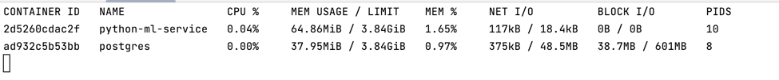
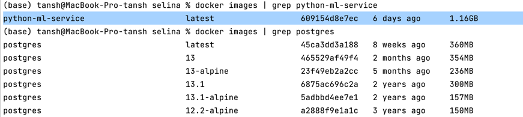

# Selina Vulnerability Scanner 
#### Diploma project

---

### Аппаратные и системные требования

Операционная система: recommend Ubuntu 20.04, Windows 10, MacOS 13.3.1
Процессор: min 4-core
Оперативная память: recommend 8 GB
Свободное дисковое пространство (SSD): recommend 20 GB

```aidl
JMM (Java memory model):
Java heap size:
2,15 GB
Chomnium (test executor) web engine:
500 MB
```
Docker containers:



Docker images:



Docker

--- 

### Необходимое программное обеспечение (программные зависимости):

- Docker version 20.10.22
- Docker Compose version v2.15.1
  - docker-image: Postgres:13.1
  - docker-image: Python:3.10
- Java SDK 11 (JRE, JVM), Java 11 (Amazon Corretto) - Write once, run everywhere
- ChromeDriver: (chromium engine 113.0.5672.162)
- GNU bash, version 3.2.57 
- Python 3.10.10
- IntelliJ IDEA 2022.2.1 (Ultimate Edition)
- Pycharm 2021.2.3 (Community Edition)

--- 

### Установка и настройка:
1) Открыть (clone) проекты: 
- Selina (IDEA)
- Python-ML (Pycharm)
2) Дождаться индексации проектов и загрузку основных библиотек языка
- for Java Application `./gradlew build`
- for Python Application `pip install -r requirements.txt`
3) Создать (build) докер image для запуска сервиса машинного обучения
```aidl
docker build . -t python-ml-service # to create image
```
Дополнительно:
```aidl
# Поднимите контейнер сервиса на порту 8080
# docker run -it -p 8080:8081 --name service3 python-ml-service
# Зайти в контейнер можно следующей командой
# docker exec -it 10f33e7c0443 /bin/bash
```
5) В Java приложении зайти в директорию, где расположен docker-compose.yaml
6) Поднять контейнера базы данных, и python-ml сервиса командой
```docker-compose up```
7) Запустить SelinaApplication
8) Дождаться завершения Liquibase миграций
9) Проверить накат миграций в Postgres (схема selina, default user: postgres, passwd: posgres)
10) В корневой папке модуля test задать URL адрес для сканирования
11) Запустите тесты: `./gradlew test`
12) Запуск отчета по результатам сканирования: `./gradlew allureServe`
